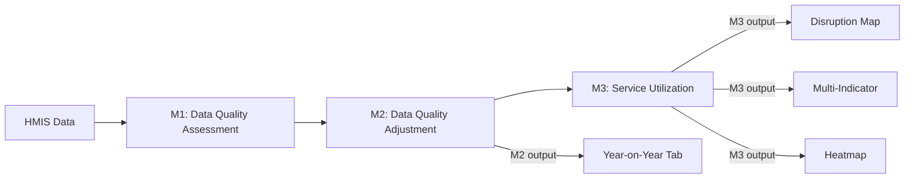

# Getting Started

This guide will help you get started with the Health Service Disruption Mapping application.

## Accessing the Application

The application is hosted on Hugging Face Spaces:

**[https://huggingface.co/spaces/CIJBoulange/health-disruption-mapping](https://huggingface.co/spaces/CIJBoulange/health-disruption-mapping)**

!!! note "First Load"
    The app may take 30-60 seconds to wake up if it hasn't been used recently.

## Data Source

This app visualizes outputs from the [FASTR Analytics Platform](https://fastr-analytics.github.io/fastr-resource-hub/).

The FASTR Analytics Platform is a web-based tool designed to support data quality assessment, adjustment, and analysis for routine health data. It allows users to upload and analyze data from various sources, including DHIS2, with built-in statistical methods to generate an adjusted dataset and run priority analyses on selected indicators.

### Data Flow

- **M2 (Data Quality Adjustment)**: [Documentation](https://fastr-analytics.github.io/fastr-resource-hub/05_data_quality_adjustment/)
- **M3 (Service Utilization)**: [Documentation](https://fastr-analytics.github.io/fastr-resource-hub/06a_service_utilization/)

## Interface Overview

The application has several tabs:

### Disruption Map

Main choropleth map view for a single health indicator. Shows percent change between actual and expected service delivery across administrative areas. Use this for focused analysis of one indicator at a time.

**Input**: M3 (Service Utilization) output

### Multi-Indicator

Side-by-side comparison of 2 indicators on the same map layout. Useful for identifying patterns across related services (e.g., comparing ANC1 and facility deliveries).

**Input**: M3 (Service Utilization) output

### Year-on-Year Change

Compares service utilization between the current year and the previous year. Shows whether services are recovering, stable, or declining compared to the same period last year.

**Input**: M2 (Data Quality Adjustment) output from the [FASTR Analytics Platform](https://fastr-analytics.github.io/fastr-resource-hub/05_data_quality_adjustment/)

**Options**:

- **Adjusted vs Raw**: Toggle between outlier-adjusted values or raw reported values. Adjusted values correct for reporting anomalies identified in M1.
- **Period selection**: Compare specific months or cumulative year-to-date totals
- **Indicator**: Select which health service to analyze

**Use case**: Track recovery after a disruption event, monitor seasonal patterns, or assess whether interventions are having an impact compared to the baseline year.

### Heatmap

Matrix visualization showing all indicators across all administrative areas. Quickly identify which services and locations have the most severe disruptions.

**Input**: M3 (Service Utilization) output

### Data Table

Raw data view in tabular format. Filter, sort, and export the underlying numbers.

## Language Toggle

Click the **EN/FR** button in the sidebar to switch between English and French. All labels, legends, and map titles will update accordingly.

## Basic Workflow

1. **Select Country**: Choose from the dropdown menu
2. **Upload Data**: Upload your M3 disruption CSV file
3. **Select Parameters**: Choose year and indicator
4. **View Map**: The map automatically updates
5. **Export**: Download the map as PNG

## Next Steps

- [Uploading Data](uploading-data.md) - Learn about data requirements
- [Creating Maps](creating-maps.md) - Customize your visualizations
- [Exporting Maps](exporting-maps.md) - Download and share your maps
